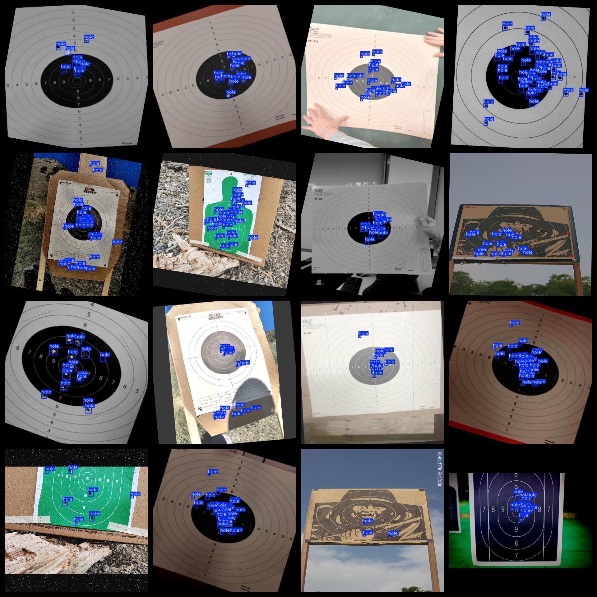
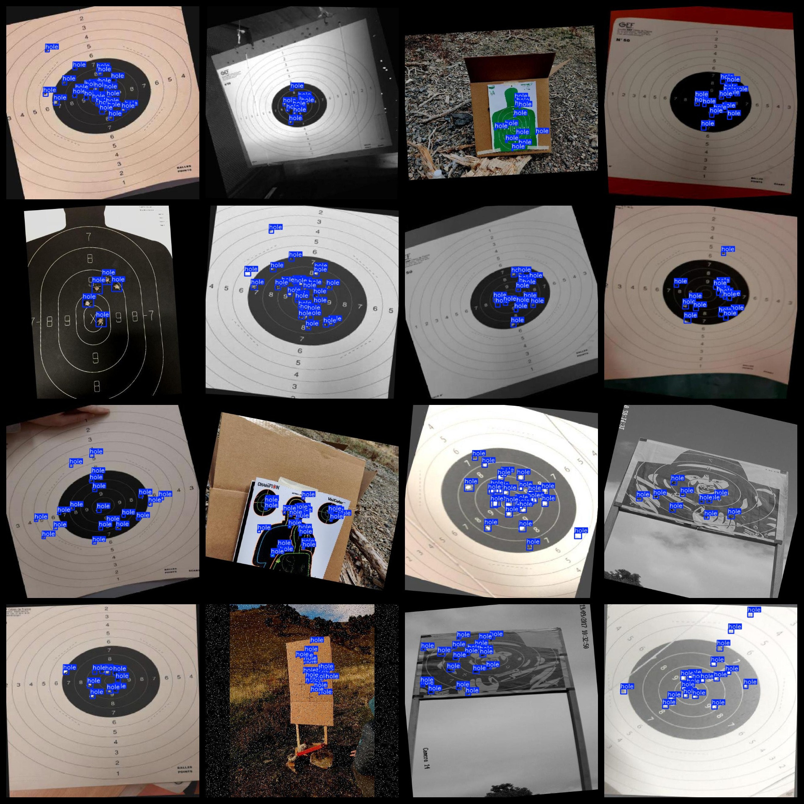

# Target on Bullet Hole Detection Dataset 9856 imagesVOC+YOLO format

Target on Bullet Hole Detection Dataset 9856 images in VOC+YOLO format

Dataset format: Pascal VOC format + YOLO format (txt file without split path, only containing jpg images and corresponding VOC format xml files and yolo format txt files)

Number of images (jpg file count): 9856

Number of annotations (xml file count): 9856

Number of annotations (txt file count): 9856

Number of annotation categories: 1

Repository location: datasets_sl

Annotation category name: ["hole"]

Number of boxes per category:

- hole boxes = 184801

Total number of boxes: 184801

Number of images per category:

- hole images = 9856

Image resolution: 640x640

Annotation tool used: labelImg

Dataset enhancement status: Yes

Annotation rules: Draw a rectangle around the category

Important note: The dataset does not have a division into training, validation, and test sets; users should divide it themselves.

Special declaration: This dataset does not provide any guarantees for the accuracy of the models or weight files trained.

Annotation and image details are as follows:

## Images

---

Here is a pay link on Stripe (https://buy.stripe.com/3cs8yP7sY87d0vu9AB). Please contact me lonlonago@foxmail.com after funding $89, and I will send you a complete data files, thank you!

